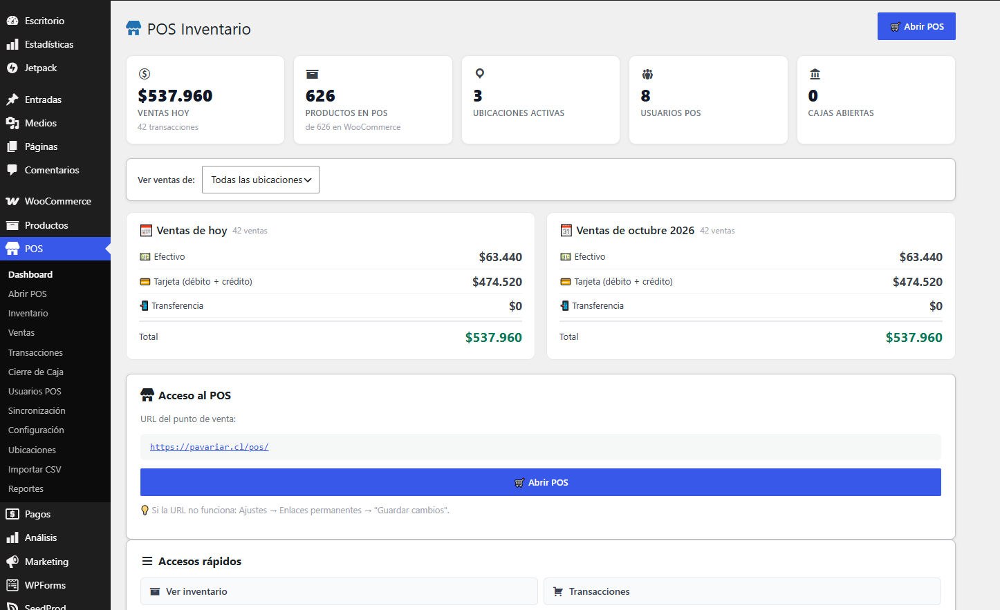
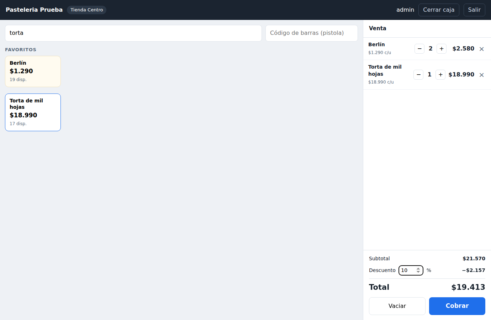
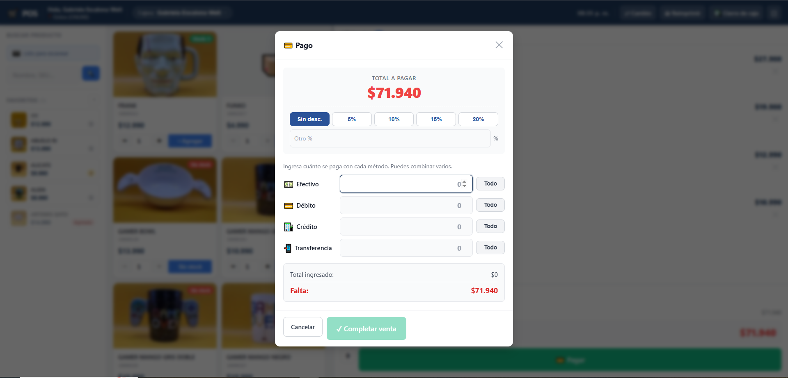
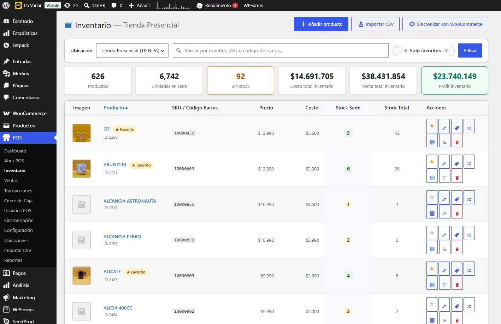
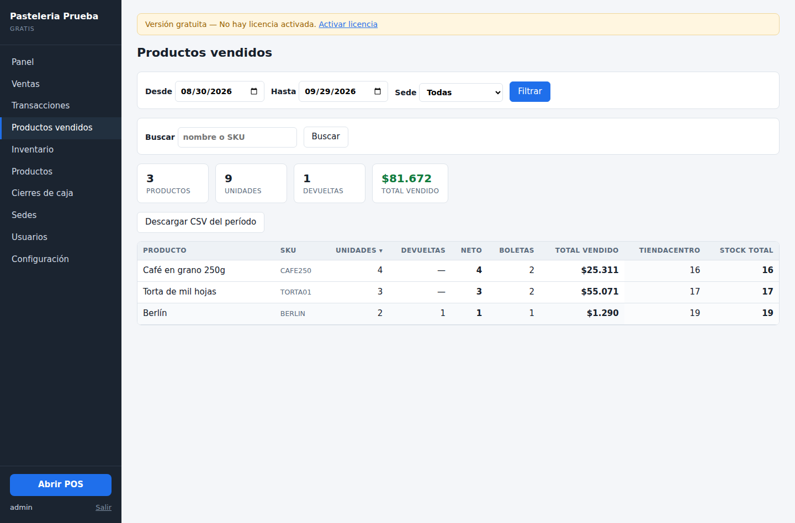
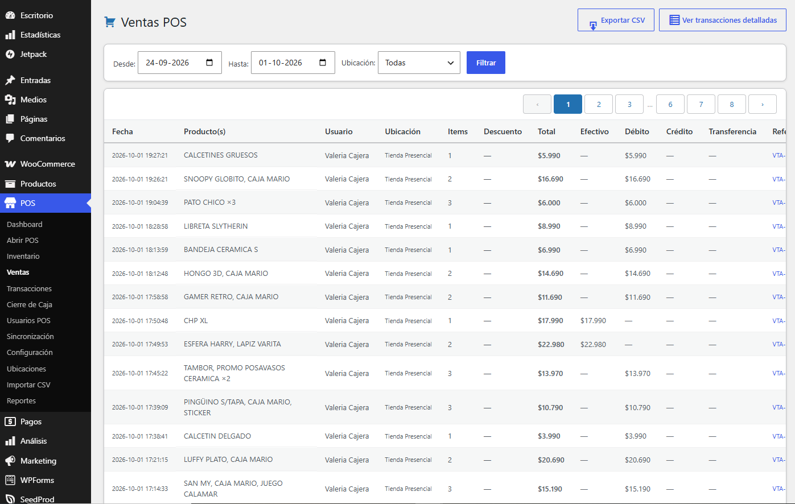
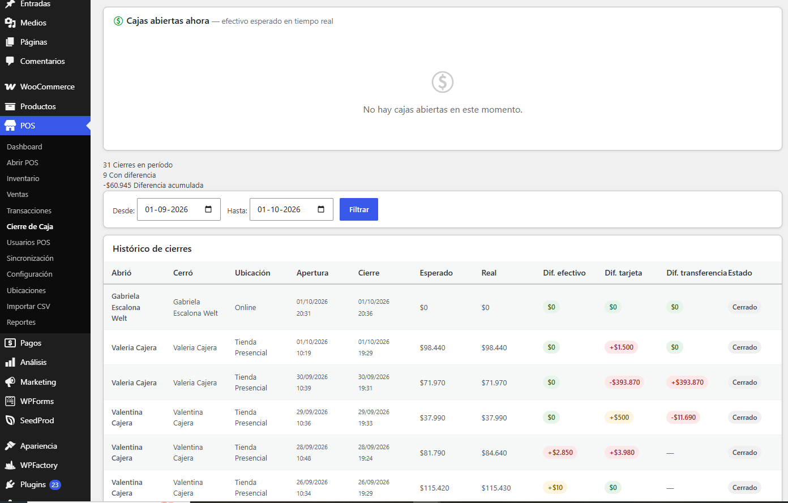

# POS Multisede para WordPress + WooCommerce

Plugin de punto de venta e inventario que conecta el local físico con la tienda
online. En operación diaria desde septiembre 2026 en PaVariar, sobre bodega,
tienda presencial y tienda online.

> **Este repositorio muestra el producto, no el código.** Es un plugin comercial
> y su código fuente es privado. Si eres parte de un proceso de selección y
> quieres revisarlo, escríbeme y te doy acceso de lectura.

---

## El problema

Una tienda que vende por WooCommerce y también en mostrador lleva, en la
práctica, dos inventarios. Se vende la última unidad en el local y la web sigue
ofreciéndola; llega el pedido online y no hay stock. La solución habitual es que
alguien actualice a mano, dos veces al día, y aun así se sobrevende.

Este plugin hace que **la tienda online sea una sede más** del inventario. Una
venta en el mostrador descuenta stock igual que un pedido de WooCommerce, y
ambas quedan en el mismo registro de movimientos.

---

## Qué hace

### Punto de venta en el navegador

Pantalla completa, fuera de wp-admin, pensada para la cajera y no para quien
administra. Buscador que filtra mientras se escribe, accesos rápidos a los
productos más vendidos de cada sede, lector de código de barras y control de
stock disponible en tiempo real.

### Pagos mixtos

Una boleta se reparte entre **efectivo, débito, crédito y transferencia** en
cualquier combinación. Cada medio se distribuye línea por línea, de modo que los
reportes por producto siguen siendo exactos aunque el pago haya sido mixto. Las
transferencias registran su número de comprobante.

### Inventario multisede

- Stock independiente por sede, con traslados que quedan registrados como
  movimiento de salida y de entrada
- Sedes configurables: se crean, desactivan y eliminan desde el panel, sin tocar
  código
- Sincronización bidireccional con el stock de WooCommerce
- Importador CSV masivo para la carga inicial
- Ajustes manuales con motivo, siempre auditables

### Reportes

Unidades vendidas, devueltas, neto, boletas y total por producto, con el **stock
actual en cada sede** en la misma tabla. Exporta a CSV todo el período filtrado,
no solo la página en pantalla.

### Cierre de caja

La cajera cuenta el efectivo y anota los totales de tarjeta y transferencia. El
sistema compara los tres contra lo registrado, guarda las diferencias y avisa por
correo a los *shop managers* cuando hay descuadre. La cajera confirma el cierre
pero no ve los montos esperados: eso lo revisa quien administra.

---

## Cómo está construido

| | |
|---|---|
| **Plataforma** | WordPress 6.x, WooCommerce |
| **Backend** | PHP 8, `$wpdb` con tablas propias, REST API vía `register_rest_route` |
| **Frontend** | JavaScript sin framework, aplicación de una sola página |
| **Permisos** | Capacidades de WordPress, con roles diferenciados para cajera y administración |
| **Correo** | `wp_mail` para los avisos de cierre de caja |

El plugin no usa el catálogo de WooCommerce como fuente de inventario: mantiene
sus propias tablas de stock por sede y sincroniza contra WooCommerce. Eso permite
que un producto exista en bodega sin estar publicado en la tienda, y que el
inventario del local no dependa de cómo esté configurado el catálogo online.

---

## Decisiones de diseño que vale la pena contar

**La tienda online es una sede, no un caso especial.** Tratarla como "la web" y
no como una ubicación más obligaba a escribir reglas aparte en cada consulta de
stock. Modelarla como una sede con una característica distinta —refleja el stock
de WooCommerce— dejó el resto del sistema sin excepciones, y permitió que el
negocio pueda crear o reemplazar esa sede desde el panel.

**Los pagos mixtos se informan.** Lo fácil es marcar la boleta
completa como "mixto" y seguir. Pero entonces el reporte por medio de pago deja
de servir. Cada línea reparte el pago en la misma proporción que el total y la
última absorbe el redondeo, de modo que la suma de las líneas coincide
exactamente con la boleta.

**El descuento de stock resiste dos cajas simultáneas.** La condición de
disponibilidad va dentro del `UPDATE`, no en una lectura previa: el motor de base
de datos garantiza que solo una de dos cajas se lleve la última unidad.

**Las zonas horarias se fijaron en `America/Santiago`.** WordPress y MySQL no
siempre coinciden en qué hora es, y un cierre de caja registrado con el día
equivocado arruina el reporte del turno.

---

## Estado

En producción y en mantenimiento activo. En desarrollo de una versión independiente
que corra sin WordPress, para locales sin conexión a internet.

**Gabriela Escalona** — Concepción, Chile
[LinkedIn](https://www.linkedin.com/in/gabriela-escalona-weldt-b32855243/) · [Correo](mailto:gescalonaweldt@gmail.com)

---

© 2026 Gabriela Escalona. Todos los derechos reservados.
Las capturas y la documentación de este repositorio se publican con fines de
portafolio. El software no es de código abierto.
