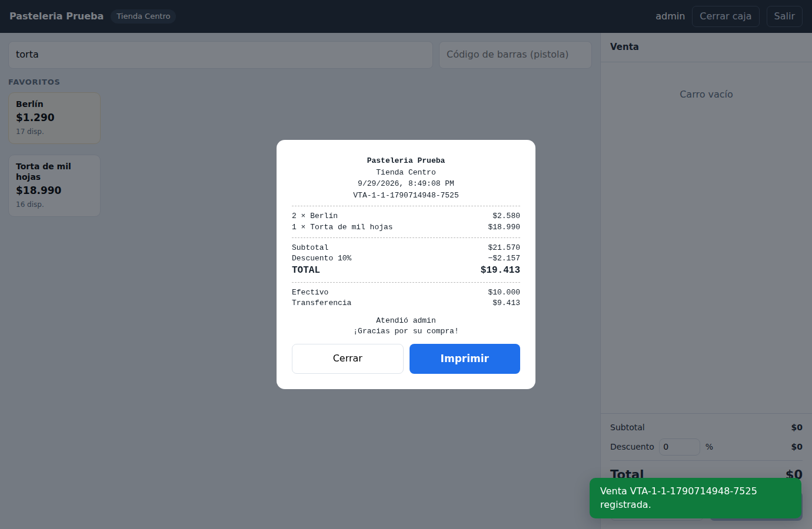
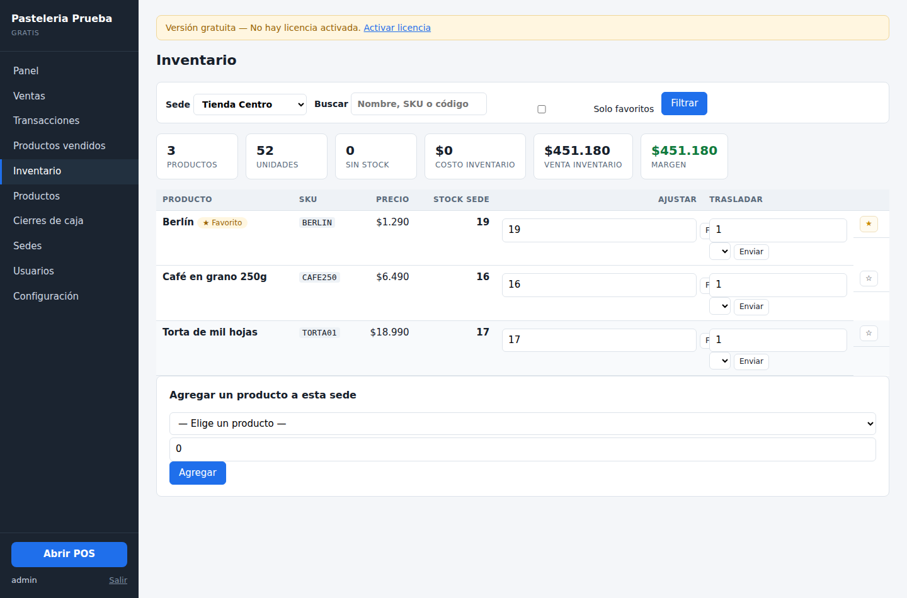
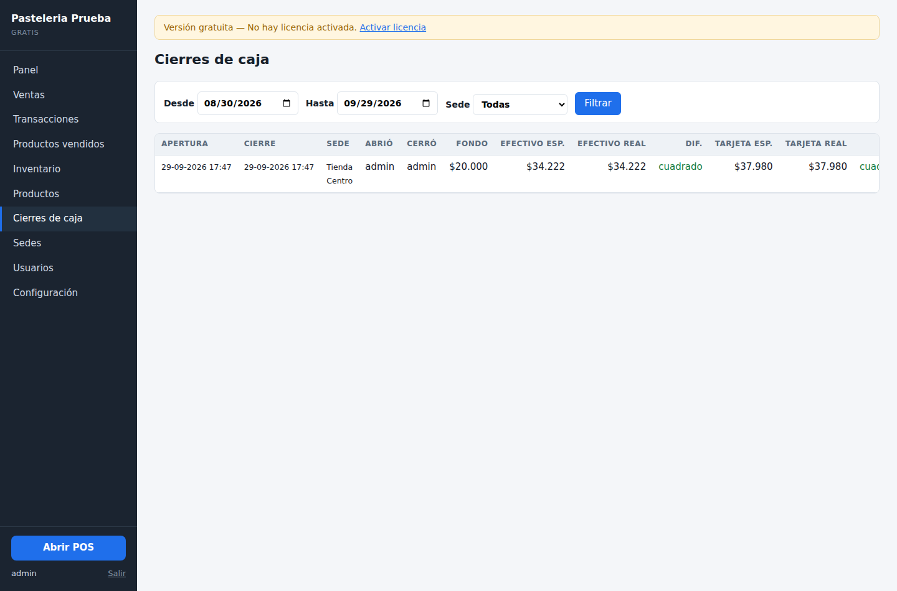

# POS y Control de Inventario Multisede

Sistema de punto de venta e inventario para negocios con más de un local.
En operación diaria desde [AÑO] en [NOMBRE DEL NEGOCIO O "un negocio de retail en Concepción"].

> **Este repositorio muestra el producto, no el código.** Es un sistema comercial
> y su código fuente es privado. Si eres parte de un proceso de selección y
> quieres revisarlo, escríbeme y te doy acceso de lectura.

---

## El problema

Un negocio con bodega, local y tienda online termina llevando el inventario en
tres lugares que nunca coinciden. Se vende algo en el local y la web sigue
ofreciéndolo; se traslada stock a bodega y nadie lo registra; al cierre del día
la caja no cuadra y no hay forma de saber dónde se perdió la diferencia.

Este sistema resuelve eso con una sola fuente de verdad: cada venta, traslado,
ajuste y devolución queda registrado como un movimiento con su sede, su usuario
y su hora.

---

## El punto de venta

Pensado para que una cajera sin capacitación previa pueda operarlo, con pantalla
táctil o con teclado a ciegas.

Buscador que filtra mientras se escribe, accesos rápidos a los productos más
vendidos de cada sede, y campo dedicado para el lector de código de barras. El
stock disponible se muestra en cada producto y se bloquea la venta si no alcanza.

### Pagos mixtos

Una boleta puede repartirse entre **efectivo, débito, crédito y transferencia**
en cualquier combinación. El monto de cada medio se prorratea línea por línea, de
modo que los reportes por producto siguen siendo exactos aunque el pago haya sido
mixto. El vuelto se calcula solo sobre el efectivo. Las transferencias registran
su número de comprobante.

---

## Inventario por sede

- Stock independiente por sede, con traslados entre ellas que se registran como
  movimiento de salida y de entrada
- Descuento de stock seguro cuando dos cajas venden el mismo producto al mismo
  tiempo
- Importador CSV masivo para la carga inicial
- Ajustes manuales con motivo, siempre auditables

---

## Reportes y cierre de caja

Unidades vendidas, devueltas, neto, boletas y total por producto, con el **stock
actual en cada sede** en la misma tabla: responde "qué se vende y cuánto me
queda" sin cruzar dos planillas. Exporta a CSV todo el período filtrado, no solo
la página en pantalla.

Al cerrar el turno, la cajera cuenta el efectivo y anota los totales de tarjeta y
transferencia. El sistema compara los tres contra lo registrado y guarda las
diferencias. La cajera confirma el cierre pero no ve los montos esperados: eso lo
revisa quien administra, y le llega por correo si hay descuadre.

---

## Cómo está construido

| | |
|---|---|
| **Backend** | PHP 8, PDO, sin framework ni dependencias externas |
| **Base de datos** | MySQL / MariaDB o SQLite, mismo esquema en ambos motores |
| **Frontend** | JavaScript sin framework, aplicación de una sola página |
| **Integración** | WooCommerce (versión plugin) |
| **Despliegue** | Hosting compartido, servidor propio o el computador del local |

Existe en dos versiones: un **plugin de WordPress** integrado con el flujo de
pedidos de WooCommerce, y una **aplicación independiente** que corre sin
WordPress, pensada para locales que no tienen internet.

---

## Decisiones de diseño que vale la pena contar

**Los pagos mixtos se prorratean, no se adjudican.** Lo fácil es marcar la boleta
completa con un método "mixto" y seguir. Pero entonces el reporte de ventas por
medio de pago deja de servir. Cada línea reparte el pago en la misma proporción
que el total, y la última línea absorbe el redondeo, de modo que la suma de las
líneas siempre coincide exactamente con la boleta.

**Sin licencia, el sistema sigue vendiendo.** El licenciamiento limita las
funciones de gestión, no la caja. Dejar a un negocio sin poder cobrar por un
problema administrativo le cuesta plata real a un tercero, y ninguna política de
cobro justifica eso.

**La licencia se valida sin conexión.** Un local sin internet no puede consultar
un servidor de licencias. Cada licencia es un bloque firmado criptográficamente
que el sistema verifica contra una clave pública incrustada: funciona offline y
el cliente no puede alterar su plan ni su vencimiento sin invalidar la firma.

**Un solo esquema para dos motores.** SQLite para el local que no quiere
administrar un servidor de base de datos; MySQL para quien ya lo tiene. Mismo
código, misma funcionalidad, el instalador decide.

---

## Estado

En producción y en mantenimiento activo. Disponible para licenciamiento.

**Gabriela Escalona** — Desarrolladora de software, Concepción, Chile
[LinkedIn](URL) · [correo](mailto:TU-CORREO) · [pavariar.cl](https://pavariar.cl)

---

© [AÑO] Gabriela Escalona. Todos los derechos reservados.
Las capturas y la documentación de este repositorio se publican con fines de
portafolio. El software no es de código abierto.
